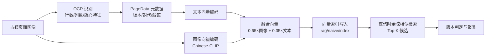
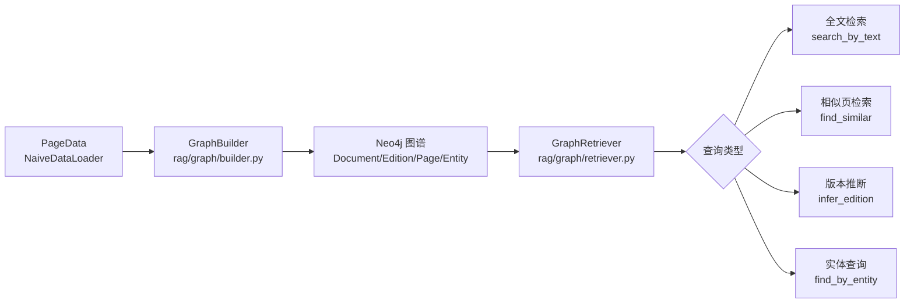

# 古文字识别助手：关键流程示意

> 使用 Mermaid 流程图描述项目关键步骤，可在 VS Code / GitHub / mermaid.live 中预览，用于论文配图。

---

## 1. 古籍影像总体处理流程

---

## 2. 版本指纹构建与相似版本检索

---

## 3. GraphRAG 知识图谱构建与推理

---

## 4. 著录识别与 RAG 语义增强流程

